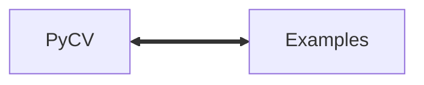

# How to use pycv

The lesson contains a guide to set up pycv and some simple examples.

```mermaid
flowchart LR
A[PyCV]
B[Examples]

A <===> B

click A "README.md" "An introduction to PyCV"
click B "examples.md" "Some basic examples for PyCV"
```
